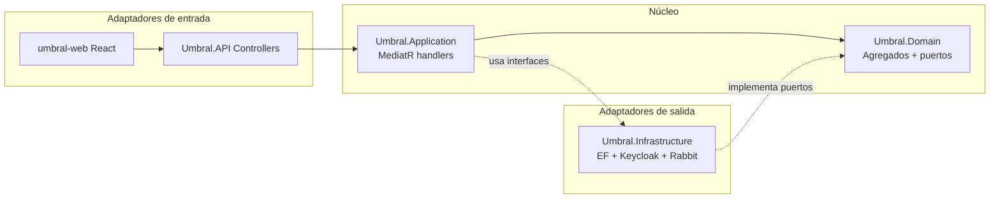

# Guía de defensa — Arquitectura, patrones, handlers y tests

Documento de referencia para la defensa oral del proyecto **UMBRAL_UCAB**.  
Consolida: capas hexagonales, patrones de diseño con rutas reales, inventario de handlers MediatR, rol de `Umbral.API`, estrategia de pruebas y gate de cobertura ≥ 90%.

**Referencias cruzadas:** [`README.md`](../README.md) · [`CLAUDE.md`](../CLAUDE.md) · [`docs/TRAZABILIDAD.md`](TRAZABILIDAD.md) · [`docs/Enunciado_Proyecto_UMBRAL_UCAB.md`](Enunciado_Proyecto_UMBRAL_UCAB.md)

---

## 1. Visión general del repositorio

```
UMBRAL_UCAB/
├── src/backend/
│   ├── Umbral.Domain/           ← Núcleo de negocio (sin EF, sin HTTP)
│   ├── Umbral.Application/      ← Casos de uso (MediatR + CQRS)
│   ├── Umbral.Infrastructure/   ← Adaptadores de salida (EF, Keycloak, mensajería)
│   └── Umbral.API/              ← Adaptador de entrada HTTP (host ejecutable)
├── src/frontend/umbral-web/     ← Cliente React + Vite
├── tests/
│   ├── Umbral.Domain.Tests/
│   ├── Umbral.Application.Tests/
│   ├── Umbral.Infrastructure.Tests/
│   └── Umbral.API.Tests/
├── scripts/
│   ├── run-coverage.ps1         ← Cobertura local (Windows)
│   └── run-coverage.sh          ← Cobertura local + CI (Linux/macOS)
├── coverlet.runsettings         ← Exclusiones de cobertura (migraciones EF, etc.)
└── .github/workflows/ci.yml     ← CI: tests + gate ≥ 90%
```

**Solución .NET:** `Umbral.sln` (raíz del repo).

---

## 2. Arquitectura hexagonal: las cuatro capas backend

El enunciado UCAB pide **dominio + aplicación + infraestructura** y casos de uso con **MediatR/CQRS**. Eso está en tres librerías. **`Umbral.API` no es una capa de negocio extra**: es el **adaptador de entrada (puerto primario / driving adapter)**.



### Tabla de proyectos

| Proyecto | Ruta base | Qué lleva |
|----------|-----------|-----------|
| **Domain** | `src/backend/Umbral.Domain` | Agregados (`Mision`, `Sesion`, `Pregunta`, `Categoria`, `UsuarioAdministrable`), value objects, eventos de dominio, **puertos** (`ISesionRepository`, `IEventPublisher`, …). Sin EF, sin HTTP. |
| **Application** | `src/backend/Umbral.Application` | Commands/Queries, **handlers MediatR**, FluentValidation, `Result<T>`, `ValidationBehavior`. Depende solo de Domain. |
| **Infrastructure** | `src/backend/Umbral.Infrastructure` | Implementaciones de puertos: repositorios EF, `KeycloakIdentityService`, `UmbralDbContext`, migraciones, `NoOpEventPublisher`. |
| **API** | `src/backend/Umbral.API` | Host ASP.NET: controllers, contratos HTTP (`Contracts/`), auth JWT, middleware de errores, CORS. **No contiene reglas de negocio**; delega en `IMediator`. |

### Composición en el arranque

Archivo: `src/backend/Umbral.API/Program.cs`

```csharp
builder.Services.AddApplication();      // MediatR + validators
builder.Services.AddInfrastructure(builder.Configuration);  // EF + repos + Keycloak
builder.Services.AddUmbralApi(builder.Configuration, builder.Environment);  // Auth + middleware
```

### Frase para la defensa sobre `Umbral.API`

> “Hexagonal separa **núcleo** (Domain + Application) de **adaptadores**. Infrastructure es adaptador de **salida** (BD, Keycloak, mensajería). **Umbral.API** es adaptador de **entrada** HTTP: traduce REST y JWT en commands/queries MediatR, sin duplicar reglas de negocio. Los tres proyectos del enunciado más el host web cumplen Ports & Adapters y Clean Architecture.”

### Regla de dependencias

Cada capa solo referencia capas a su **izquierda**:

```
Umbral.API  →  Application, Infrastructure
Umbral.Application  →  Domain
Umbral.Infrastructure  →  Domain
Umbral.Domain  →  (ninguna capa de aplicación)
```

---

## 3. Mapa de carpetas del dominio

```
src/backend/Umbral.Domain/
├── CatalogoMision/Mision/     → Mision, Etapa*, Pista, IMisionRepository, snapshots
├── CatalogoTrivia/              → Categoria, Pregunta, repos
├── Sesion/                      → Sesion, estados, contextos, evidencias, ISesionRepository
├── IdentidadYAccesos/           → UsuarioAdministrable, IIdentityService, IUsuarioRepository
├── Ports/                       → IEventPublisher, INotificacionRealTime
└── Shared/                      → AggregateRoot, Entity, ValueObject, DomainException
```

**Infrastructure (espejo de puertos):**

```
src/backend/Umbral.Infrastructure/
├── Persistence/
│   ├── Repositories/          → SesionRepository, MisionRepository, …
│   ├── Configurations/        → Mapeo EF (TPH etapas, etc.)
│   └── Migrations/            → Esquema PostgreSQL
├── Identidad/                 → KeycloakIdentityService, UsuariosEspejoSeeder
└── Messaging/Publishers/      → NoOpEventPublisher (E2: Rabbit/SignalR real)
```

---

## 4. Patrones de diseño y dónde están

Referencia académica del enunciado: `docs/Enunciado_Proyecto_UMBRAL_UCAB.md` (tabla Strategy, Composite, State, Facade, etc.).

### 4.1 Arquitectura y estilo

| Patrón / principio | Dónde (ruta relativa al repo) | Justificación en defensa |
|--------------------|-------------------------------|---------------------------|
| **Hexagonal / Ports & Adapters** | Puertos: `src/backend/Umbral.Domain/**/I*Repository.cs`, `Ports/IEventPublisher.cs`. Adaptadores: `Infrastructure/`, `API/Controllers/` | Domain define contratos; Infrastructure y API los implementan/consumen sin referenciar EF/HTTP desde el dominio. |
| **Clean Architecture** | Cuatro proyectos + regla de dependencias | Separación explícita dominio / casos de uso / infra / presentación. |
| **CQRS** | Carpetas `Commands/` y `Queries/` bajo `Umbral.Application` | Escritura vs lectura separadas; un handler por caso de uso. |
| **Mediator (MediatR)** | `src/backend/Umbral.Application/DependencyInjection/ApplicationServiceCollectionExtensions.cs` | Controllers no llaman repos; envían `Command`/`Query`. |
| **Pipeline / Chain of Responsibility** | `Application/Common/Behaviors/ValidationBehavior.cs` + `*Validator.cs` | FluentValidation corre antes del handler. |
| **Repository** | Puertos en Domain; impl en `Infrastructure/Persistence/Repositories/` | Persistencia detrás de interfaz del dominio (DIP). |
| **Dependency Injection** | `*ServiceCollectionExtensions.cs` en Application, Infrastructure, API | Wiring en composición raíz (`Program.cs`). |
| **DTO / anti-corrupción** | `API/Contracts/`, DTOs en Application | HTTP no expone entidades de dominio. |
| **Adapter** | `Infrastructure/Identidad/KeycloakIdentityService.cs`, repos EF | Adaptan Keycloak/Postgres a puertos del dominio. |
| **Facade** | Controllers delgados, p. ej. `API/Controllers/SesionesController.cs` → `_mediator.Send(...)` | Una entrada HTTP oculta muchos comandos/consultas. |
| **Cross-cutting: excepciones** | `API/Middlewares/ExceptionHandlingMiddleware.cs` | Errores → respuestas HTTP uniformes (`ApiErrorResponse`). |

### 4.2 DDD (Domain-Driven Design)

| Concepto | Rutas clave |
|----------|-------------|
| **Aggregate Root** | `Domain/CatalogoMision/Mision/Mision.cs`, `Domain/Sesion/Sesion.cs`, `Domain/CatalogoTrivia/Pregunta/Pregunta.cs`, `Domain/IdentidadYAccesos/UsuarioAdministrable.cs` |
| **Entity / Value Object** | `Domain/Shared/Entity.cs`, `ValueObject.cs`; IDs tipados (`SesionId`, `MisionId`, …) |
| **Domain events** | `Domain/Sesion/Events/`, `Domain/CatalogoMision/Mision/Events/` |
| **Domain services** | `Domain/Sesion/Validacion/ValidacionEvidenciaService.cs`, `Domain/Sesion/CalculoPuntajeBusquedaService.cs` |
| **Bounded contexts** | Carpetas `CatalogoMision`, `CatalogoTrivia`, `Sesion`, `IdentidadYAccesos` |
| **Factory method** | `Mision.Crear`, `Sesion.CrearDesdeMision`, factories en etapas |

### 4.3 Patrones GoF del enunciado

| Patrón | Implementación | Rutas |
|--------|----------------|-------|
| **State** | Ciclo de vida de sesión con transiciones guardadas en el agregado | `Domain/Sesion/EstadoSesion.cs`, lógica en `Domain/Sesion/Sesion.cs` |
| **Composite** | Misión compuesta por etapas polimórficas (BT \| Trivia) | `Domain/CatalogoMision/Mision/Etapa.cs` (abstracta), `EtapaBusquedaTesoro.cs`, `EtapaTrivia.cs`; en sesión: `ContextoMision.cs` + snapshots |
| **Strategy** | Cálculo de puntaje según modalidad | `Domain/Sesion/CalculoPuntajeBusquedaService.cs` (*BusquedaTesoroStrategy*) |
| **Template Method** | Flujo fijo de registro de evidencia | `Sesion.RegistrarEvidencia` en `Domain/Sesion/Sesion.cs` |
| **Chain of Responsibility** | Validación evidencia + pipeline MediatR | `ValidacionEvidenciaService` + reglas en `RegistrarEvidencia`; `ValidationBehavior` |
| **Proxy / control de acceso** | Roles JWT; datos sensibles fuera de GET | `[Authorize(Roles = "...")]` en controllers; password no en DTOs de usuario |
| **Facade (dominio)** | Coordinación de etapa actual y progresión | `Domain/Sesion/ContextoMision.cs` |

> **Nota para el jurado:** no hay una clase llamada `ComponenteMision`; el **Composite** se argumenta con `Mision` + colección polimórfica de `Etapa`. Algunos patrones (p. ej. Proxy clásico) se evidencian como **seguridad + puertos**, no como clase `Proxy` nominal.

### 4.4 Patrones en detalle: qué, dónde y por qué

Cada entrada sigue la misma estructura: **qué patrón es**, **archivo concreto**, **por qué existe en UMBRAL** y **cómo se manifiesta**.

---

#### A. Patrones arquitectónicos (estructura del sistema)

##### 1. Arquitectura hexagonal (Ports & Adapters)

| | |
|---|---|
| **Qué es** | El núcleo de negocio no conoce HTTP ni PostgreSQL. Todo acceso externo entra/sale por **puertos** (interfaces) e **adaptadores** (implementaciones). |
| **Dónde** | **Puertos (salida):** `src/backend/Umbral.Domain/Sesion/ISesionRepository.cs`, `CatalogoMision/Mision/IMisionRepository.cs`, `Ports/IEventPublisher.cs`, `IdentidadYAccesos/Ports/IIdentityService.cs`. **Adaptadores (salida):** `src/backend/Umbral.Infrastructure/Persistence/Repositories/SesionRepository.cs`, `Infrastructure/Identidad/KeycloakIdentityService.cs`. **Adaptador (entrada):** `src/backend/Umbral.API/Controllers/*.cs`. |
| **Por qué** | El enunciado exige separación dominio / aplicación / infraestructura. Permite cambiar Keycloak, EF o el transporte HTTP sin tocar reglas de negocio. Es la base de DIP y de los tests con mocks. |
| **Cómo se ve** | `CrearUsuarioCommandHandler` depende de `IIdentityService`, no de `HttpClient` ni de Keycloak directamente. |

##### 2. Clean Architecture (capas + regla de dependencias)

| | |
|---|---|
| **Qué es** | Cuatro proyectos con dependencias unidireccionales: API → Application/Infrastructure → Domain. |
| **Dónde** | `Umbral.sln`; composición en `src/backend/Umbral.API/Program.cs` (`AddApplication`, `AddInfrastructure`, `AddUmbralApi`). |
| **Por qué** | Evita “lógica en el controller” o “reglas en el DbContext”. Cada capa tiene una responsabilidad acotada para la defensa y para el mantenimiento. |
| **Cómo se ve** | `Umbral.Domain.csproj` no referencia Application ni Infrastructure. |

##### 3. CQRS (Command Query Responsibility Segregation)

| | |
|---|---|
| **Qué es** | Separar operaciones que **mutan estado** (commands) de las que **solo leen** (queries). |
| **Dónde** | Carpetas paralelas bajo `src/backend/Umbral.Application/`: p. ej. `Sesion/Commands/IniciarSesion/` vs `Sesion/Queries/GetRankingSesion/`. |
| **Por qué** | Requisito del enunciado (MediatR + CQRS). Cada caso de uso tiene un handler dedicado; lecturas no mezclan persistencia innecesaria con escritura. |
| **Cómo se ve** | `IniciarSesionCommand` + `IniciarSesionCommandHandler` (escribe); `GetRankingSesionQuery` + `GetRankingSesionQueryHandler` (lee). |

##### 4. Mediator (MediatR)

| | |
|---|---|
| **Qué es** | Un bus desacopla quien **invoca** el caso de uso de quien lo **ejecuta**. |
| **Dónde** | Registro: `src/backend/Umbral.Application/DependencyInjection/ApplicationServiceCollectionExtensions.cs`. Uso: todos los controllers, p. ej. `src/backend/Umbral.API/Controllers/SesionesController.cs` → `_mediator.Send(...)`. |
| **Por qué** | Los controllers no conocen 45 handlers distintos; solo conocen commands/queries. Facilita pipeline transversal (validación) y tests de handlers aislados. |
| **Cómo se ve** | `SesionesController` no instancia `IniciarSesionCommandHandler`; envía `new IniciarSesionCommand(id)` al mediator. |

##### 5. Repository

| | |
|---|---|
| **Qué es** | Abstracción de persistencia: el dominio pide “guardar/buscar agregados”, no SQL. |
| **Dónde** | **Contrato:** `src/backend/Umbral.Domain/Sesion/ISesionRepository.cs`. **Implementación:** `src/backend/Umbral.Infrastructure/Persistence/Repositories/SesionRepository.cs` (EF Core + `Include` de participantes, contextos, evidencias). |
| **Por qué** | DDD: el agregado `Sesion` no sabe de PostgreSQL. Application tests mockean `ISesionRepository` con NSubstitute sin BD. |
| **Cómo se ve** | `SubmitEvidenciaCommandHandler` llama `_sesionRepository.FindByIdAsync` y `SaveAsync`; el SQL vive solo en Infrastructure. |

##### 6. Adapter

| | |
|---|---|
| **Qué es** | Convierte la API de un sistema externo al contrato que espera el dominio. |
| **Dónde** | `src/backend/Umbral.Infrastructure/Identidad/KeycloakIdentityService.cs` implementa `IIdentityService` (puerto en Domain). Repositorios EF adaptan filas/tablas a `Sesion`, `Mision`, etc. |
| **Por qué** | Keycloak habla REST/JSON; el dominio habla `KeycloakUserId`, `RolSistema`, `EmailAddress`. Si mañana cambia el IdP, solo se reemplaza el adaptador. |
| **Cómo se ve** | `CrearUsuarioCommandHandler` llama `_identity.RegistrarEnIdentityServerAsync(...)` sin saber URLs de Keycloak. |

##### 7. Facade

| | |
|---|---|
| **Qué es** | Interfaz simplificada sobre un subsistema complejo. |
| **Dónde** | **HTTP:** controllers delgados (`MisionesController`, `SesionesController`). **Dominio/sesión:** `src/backend/Umbral.Domain/Sesion/ContextoMision.cs` coordina etapa actual, ganador y avance sin que `Sesion` repita índices. |
| **Por qué** | El cliente HTTP ve un endpoint; detrás hay validación, handler, dominio, repo y eventos. `ContextoMision` oculta la complejidad de progresión secuencial por etapas. |
| **Cómo se ve** | `Sesion.RegistrarEvidencia` delega en `ContextoMision.ObtenerEtapaBusquedaTesoroActual()` en lugar de indexar listas manualmente en cada método. |

##### 8. Dependency Injection (IoC)

| | |
|---|---|
| **Qué es** | Las clases reciben dependencias por constructor; el contenedor las resuelve al arrancar. |
| **Dónde** | `ApplicationServiceCollectionExtensions.cs`, `InfrastructureServiceCollectionExtensions.cs`, `ApiServiceCollectionExtensions.cs`; punto de entrada `Program.cs`. |
| **Por qué** | DIP: handlers dependen de interfaces. Permite inyectar `NoOpEventPublisher` en E1 y Rabbit/SignalR en E2 sin cambiar Application. |
| **Cómo se ve** | `services.AddScoped<ISesionRepository, SesionRepository>()` en Infrastructure. |

##### 9. Anti-corruption layer (DTOs en el borde)

| | |
|---|---|
| **Qué es** | Contratos HTTP separados del modelo de dominio para no “contaminar” entidades con JSON ni exponer campos internos. |
| **Dónde** | `src/backend/Umbral.API/Contracts/` (p. ej. `CrearMisionRequest`, `SesionResumenResponse`); DTOs de Application en `Application/Misiones/Models/`, `Application/IdentidadYAccesos/Models/`. |
| **Por qué** | RB de seguridad: password de usuario no aparece en GET. El dominio no conoce `[FromBody]` ni códigos HTTP. |
| **Cómo se ve** | Controller mapea `CrearMisionRequest` → `CrearMisionCommand`; la respuesta no devuelve `UsuarioAdministrable` sino un DTO sin password. |

---

#### B. Patrones de comportamiento (GoF y variantes)

##### 10. State (estado de sesión)

| | |
|---|---|
| **Qué es** | Un objeto cambia comportamiento según su estado; solo algunas transiciones son válidas. |
| **Dónde** | Enum: `src/backend/Umbral.Domain/Sesion/EstadoSesion.cs` (Programada → EnPreparacion → Activa → Pausada/Finalizada/Cancelada). Transiciones: `src/backend/Umbral.Domain/Sesion/Sesion.cs` — métodos `AbrirParaRegistro()`, `Iniciar()`, `Pausar()`, `Reanudar()`, `Finalizar()`, `Cancelar()`. |
| **Por qué** | RB del dominio: no puedes iniciar una sesión que no está en preparación; no puedes unirte si ya está Activa. Centralizar evita estados inválidos en BD. |
| **Cómo se ve** | `Iniciar()` comprueba `Estado != EnPreparacion` y lanza `DomainException` si no aplica. |

##### 11. Composite (misión → etapas polimórficas)

| | |
|---|---|
| **Qué es** | Estructura jerárquica: un contenedor (`Mision`) trata por igual componentes que pueden ser de distinto tipo (`EtapaBusquedaTesoro`, `EtapaTrivia`). |
| **Dónde** | **Catálogo:** `Etapa.cs` (abstracta), `EtapaBusquedaTesoro.cs`, `EtapaTrivia.cs`, lista en `Mision.cs` (`_etapas`). **En sesión (runtime):** `MisionSnapshot.cs` + `EtapaSnapshotBase` + subtipos; `ContextoMision.cs` recorre etapas secuenciales. |
| **Por qué** | RF E1/E2: una misión puede mezclar BT y Trivia en secuencia. Composite + polimorfismo evitan `if (tipo == "BT")` por todo el código. |
| **Cómo se ve** | `Mision.AgregarEtapaBusquedaTesoro` / `AgregarEtapaTrivia` añaden al mismo `_etapas`; `CrearMisionCommandHandler` elige tipo según `TipoEtapa` del input. |

##### 12. Strategy (cálculo de puntaje)

| | |
|---|---|
| **Qué es** | Algoritmo intercambiable según variante del dominio (modalidad, dificultad, etc.). |
| **Dónde** | `src/backend/Umbral.Domain/Sesion/CalculoPuntajeBusquedaService.cs` — comentario explícito a *BusquedaTesoroStrategy*; invocado desde `Sesion.ProcesarEvidenciaGanadora` en `Sesion.cs` línea ~277. |
| **Por qué** | Puntaje BT (100 pts ganador) es distinto al que tendrá trivia (E2). Separar en servicio de dominio permite añadir `CalculoPuntajeTriviaService` sin modificar todo `Sesion`. |
| **Cómo se ve** | `var puntos = CalculoPuntajeBusquedaService.Calcular(esGanador: true);` — hoy estático; en E2 puede evolucionar a interfaz `ICalculoPuntajeStrategy` sin cambiar el flujo de evidencia. |

##### 13. Template Method (flujo de evidencia)

| | |
|---|---|
| **Qué es** | Esqueleto de algoritmo fijo con pasos definidos; algunas variantes en subpasos. |
| **Dónde** | `Sesion.RegistrarEvidencia` y `ProcesarEvidenciaGanadora` en `src/backend/Umbral.Domain/Sesion/Sesion.cs` (aprox. líneas 228–298). |
| **Por qué** | HU-18 / RB-06: toda evidencia pasa por los mismos pasos (validar estado → validar QR → anti-duplicado → anti-segundo-ganador → registrar → puntaje → avanzar etapa o finalizar). |
| **Cómo se ve** | Secuencia fija: `ValidacionEvidenciaService.Validar` → reglas adicionales en el agregado → `Evidencia.Registrar` → si válida, `ProcesarEvidenciaGanadora`. |

##### 14. Chain of Responsibility (cadena de validaciones)

| | |
|---|---|
| **Qué es** | Varios eslabones procesan una petición; cada uno puede rechazar o pasar al siguiente. |
| **Dónde** | **Pipeline aplicación:** `src/backend/Umbral.Application/Common/Behaviors/ValidationBehavior.cs` → validators FluentValidation (`IniciarSesionValidator.cs`, etc.). **Dominio evidencia:** `ValidacionEvidenciaService.cs` + reglas en `RegistrarEvidencia` (duplicado, ganador ya existe). **HTTP:** `ExceptionHandlingMiddleware.cs` mapea tipo de excepción → status code. |
| **Por qué** | Validación en capas: formato (Application) vs reglas de negocio (Domain). Un solo middleware traduce errores a JSON uniforme. |
| **Cómo se ve** | Request inválido nunca llega al handler si FluentValidation falla; QR inválido lo decide el dominio después. |

##### 15. Proxy / control de acceso (recursos restringidos)

| | |
|---|---|
| **Qué es** | Intermediario que controla acceso a un recurso sensible. |
| **Dónde** | **Roles:** `[Authorize(Roles = "Administrador")]` en `MisionesController.cs`, `[Authorize(Roles = "Participante")]` en endpoints de `SesionesController.cs`. **Datos:** queries de usuario sin password; pistas/QR de solución no expuestos al participante en DTOs de etapas. **Tests:** `TestAuthHandler.cs` simula identidad sin Keycloak real. |
| **Por qué** | Enunciado pide Proxy para pistas/paneles restringidos. JWT + roles cumplen control de acceso; DTOs filtran lo que cada rol puede ver. |
| **Cómo se ve** | Participante llama GET etapas; la API no devuelve `CodigoQRSolucion` en respuestas de participante (solo operador/admin en catálogo). |

##### 16. Null Object (implementación vacía temporal)

| | |
|---|---|
| **Qué es** | Objeto que implementa una interfaz pero no hace nada, para no tener `if (publisher != null)` por todo el código. |
| **Dónde** | `src/backend/Umbral.Infrastructure/Messaging/Publishers/NoOpEventPublisher.cs`, `NoOpNotificacionRealTime.cs`; registro en `InfrastructureServiceCollectionExtensions.cs`. |
| **Por qué** | E1 aún no tiene Rabbit/SignalR productivo; los handlers ya publican eventos (`IEventPublisher`) sin romper el wiring. E2 reemplaza por implementación real. |
| **Cómo se ve** | `PublishBatchAsync` retorna `Task.CompletedTask` sin side effects. |

---

#### C. Patrones creacionales y estructurales (DDD + GoF)

##### 17. Factory Method (creación controlada de agregados)

| | |
|---|---|
| **Qué es** | Métodos estáticos/factory que garantizan objetos válidos al nacer. |
| **Dónde** | `Mision.Crear`, `Sesion.CrearDesdeMision`, `EtapaBusquedaTesoro.Crear`, `Pregunta.Crear`, `CodigoAcceso.Generar`, `UsuarioAdministrable.Crear`. |
| **Por qué** | Constructores privados + factory impiden agregados incompletos (sin ID, sin etapas, sin validación). |
| **Cómo se ve** | `private Sesion() { }` + `public static Sesion CrearDesdeMision(MisionSnapshot snapshot, ...)`. |

##### 18. Snapshot / Memento (copia inmutable al crear sesión)

| | |
|---|---|
| **Qué es** | Captura del estado de la misión en un instante para que la sesión no cambie si el admin edita el catálogo después. |
| **Dónde** | `src/backend/Umbral.Domain/CatalogoMision/Mision/MisionSnapshot.cs`, `EtapaSnapshotBase` y subtipos; persistencia JSON en `Infrastructure/Persistence/Serialization/MisionSnapshotPersistence.cs`. |
| **Por qué** | RB-11: reglas de juego congeladas al crear la sesión. Es el “memento” de la misión en el momento del `CrearSesionMision`. |
| **Cómo se ve** | `ContextoMision.Crear(snapshot)` guarda `MisionSnapshot` dentro de la sesión. |

##### 19. Value Object

| | |
|---|---|
| **Qué es** | Objeto definido por sus atributos, inmutable, comparado por valor. |
| **Dónde** | `src/backend/Umbral.Domain/Shared/ValueObject.cs`; ejemplos: `CodigoAcceso.cs`, `CodigoQR`, `Puntaje`, `EmailAddress`, IDs tipados (`SesionId`, `MisionId`). |
| **Por qué** | Evita “stringly typed” bugs (mezclar GUIDs, códigos vacíos). Encapsula validación (`CodigoAcceso.Crear` normaliza y valida). |
| **Cómo se ve** | `CoincideCon` en `CodigoAcceso` centraliza comparación case-insensitive. |

##### 20. Aggregate Root + Domain Events (variante Observer)

| | |
|---|---|
| **Qué es** | Entidad raíz que protege invariantes y notifica hechos de dominio a interesados. |
| **Dónde** | `src/backend/Umbral.Domain/Shared/AggregateRoot.cs`; eventos en `Sesion/Events/` (`SesionIniciada`, `EvidenciaValidada`, …); `RaiseDomainEvent` en `Sesion`, `Mision`. |
| **Por qué** | Desacoplar efectos secundarios (ranking tiempo real, auditoría, mensajería) del núcleo transaccional. E1 publica vía `IEventPublisher`; E2 consumirá con SignalR/Rabbit. |
| **Cómo se ve** | Tras `RegistrarEvidencia`, `RaiseDomainEvent(new EvidenciaValidada(...))`; handler llama `_eventPublisher.PublishBatchAsync(sesion.DomainEvents)`. |

##### 21. Domain Service (lógica que no pertenece a una sola entidad)

| | |
|---|---|
| **Qué es** | Operación de dominio sin estado que involucra varias entidades o reglas transversales. |
| **Dónde** | `ValidacionEvidenciaService.cs`, `CalculoPuntajeBusquedaService.cs`, `RankingService.cs` en `src/backend/Umbral.Domain/Sesion/`. |
| **Por qué** | Validar QR necesita sesión + etapa + estado; no encaja en una sola clase hija. Ranking ordena todos los participantes. |
| **Cómo se ve** | `RankingService.Calcular(participantes)` usado desde `Sesion` y `GetRankingSesionQueryHandler`. |

---

#### D. Cross-cutting y pruebas (también piden el enunciado)

##### 22. Middleware (manejo transversal de errores)

| | |
|---|---|
| **Qué es** | Componente en el pipeline HTTP que envuelve todas las peticiones. |
| **Dónde** | `src/backend/Umbral.API/Middlewares/ExceptionHandlingMiddleware.cs`; activación en `UseUmbralExceptionHandling()`. |
| **Por qué** | RNF: logging, respuestas consistentes. `DomainException` → 400, `NotFoundException` → 404, sin try/catch en cada controller. |
| **Cómo se ve** | `MapException` con `switch` pattern matching sobre tipos de excepción. |

##### 23. Test Double — Mock (NSubstitute)

| | |
|---|---|
| **Qué es** | Sustituto de dependencias en tests unitarios. |
| **Dónde** | `tests/Umbral.Application.Tests/` — p. ej. `SubmitEvidenciaCommandHandlerTests.cs`: `Substitute.For<ISesionRepository>()`. |
| **Por qué** | Enunciado pide mocks desacoplados de infraestructura. Prueba el handler sin PostgreSQL. |
| **Cómo se ve** | Mock devuelve sesión precargada; se verifica que `SaveAsync` y `PublishBatchAsync` fueron llamados. |

##### 24. Testcontainers (integración real)

| | |
|---|---|
| **Qué es** | PostgreSQL efímero en Docker para tests de integración. |
| **Dónde** | `tests/Umbral.Infrastructure.Tests/Support/PostgresFixture.cs`; `tests/Umbral.API.Tests/Support/UmbralWebAppFactory.cs`. |
| **Por qué** | Valida que EF mapea bien TPH de etapas, JSON de snapshots y repos — algo que un mock no detecta. |
| **Cómo se ve** | `PostgreSqlBuilder().WithImage("postgres:16-alpine").Build()` + migraciones al iniciar. |

---

#### E. Tabla resumen “enunciado UCAB → tu código”

| Tema enunciado | Patrón | Archivo clave para abrir en defensa |
|----------------|--------|-------------------------------------|
| Arquitectura hexagonal | Ports & Adapters | `ISesionRepository.cs` + `SesionRepository.cs` |
| CQRS + MediatR | Mediator + CQRS | `ApplicationServiceCollectionExtensions.cs` + cualquier `*CommandHandler.cs` |
| DDD agregados | Aggregate Root | `Sesion.cs`, `Mision.cs` |
| Value Objects | VO | `CodigoAcceso.cs` |
| Strategy | Strategy | `CalculoPuntajeBusquedaService.cs` |
| Composite | Composite | `Etapa.cs` + `Mision.cs` |
| State | State | `EstadoSesion.cs` + métodos ciclo de vida en `Sesion.cs` |
| Template Method | Template Method | `RegistrarEvidencia` en `Sesion.cs` |
| Chain of Responsibility | CoR | `ValidationBehavior.cs` + `ValidacionEvidenciaService.cs` |
| Facade | Facade | `ContextoMision.cs` o `SesionesController.cs` |
| Proxy | Proxy / ACL | `[Authorize]` + DTOs sin datos sensibles |
| Mocks en tests | Mock | `SubmitEvidenciaCommandHandlerTests.cs` |
| Cobertura 90% | — | `scripts/run-coverage.ps1 -Threshold 90` |

---

### 4.5 SOLID (evidencia rápida)

| Principio | Ejemplo en UMBRAL |
|-----------|-------------------|
| **SRP** | Handler = un caso de uso; `ValidacionEvidenciaService` = solo validar QR |
| **OCP** | Nuevas etapas vía `Etapa` abstracta + subtipos, sin romper `Mision` |
| **LSP** | `EtapaBusquedaTesoro` / `EtapaTrivia` sustituibles donde se espera `Etapa` |
| **ISP** | Puertos pequeños (`ICategoriaRepository`, `IIdentityService`, …) |
| **DIP** | Handlers dependen de `ISesionRepository`, no de `SesionRepository` |

---

## 5. Handlers MediatR: qué son y cómo funcionan

### 5.1 Definición

Un **handler** en este proyecto es una clase MediatR que implementa **un caso de uso**:

- **Command handler:** `IRequestHandler<TCommand, Result<...>>` — escribe (crear sesión, submit evidencia, …).
- **Query handler:** `IRequestHandler<TQuery, TDto>` — lee sin mutar agregados.

Registro automático al escanear el ensamblado Application:

`src/backend/Umbral.Application/DependencyInjection/ApplicationServiceCollectionExtensions.cs`

```csharp
services.AddMediatR(cfg =>
{
    cfg.RegisterServicesFromAssembly(assembly);
    cfg.AddBehavior(typeof(IPipelineBehavior<,>), typeof(ValidationBehavior<,>));
});
services.AddValidatorsFromAssembly(assembly);
```

### 5.2 Flujo típico

```
HTTP Request
  → Controller (Umbral.API)
  → IMediator.Send(command|query)
  → ValidationBehavior (FluentValidation)
  → *Handler (Umbral.Application)
  → Repositorio / servicio (puerto del dominio)
  → Agregado de dominio (reglas de negocio)
  → SaveAsync + IEventPublisher (opcional)
  → Result<T> / DTO → HTTP Response
```

### 5.3 Ejemplo: Submit evidencia QR

| Capa | Archivo | Responsabilidad |
|------|---------|-----------------|
| HTTP | `src/backend/Umbral.API/Controllers/SesionesController.cs` | Recibe POST, arma `SubmitEvidenciaCommand`, envía a MediatR |
| Application | `src/backend/Umbral.Application/Sesion/Commands/SubmitEvidencia/SubmitEvidenciaCommandHandler.cs` | Carga sesión, llama `sesion.RegistrarEvidencia`, persiste, publica eventos |
| Domain | `src/backend/Umbral.Domain/Sesion/Sesion.cs` | Reglas: estado activo, etapa BT, QR válido, ganador único, puntaje |
| Domain | `src/backend/Umbral.Domain/Sesion/Validacion/ValidacionEvidenciaService.cs` | Validación base del QR |

### 5.4 Excepción: `TestAuthHandler`

`src/backend/Umbral.API/Auth/TestAuthHandler.cs` **no es MediatR**. Es handler de autenticación ASP.NET para tests de integración sin JWT real de Keycloak.

---

## 6. Inventario de handlers MediatR (45)

Prefijo común: `src/backend/Umbral.Application/`

### Catálogo Trivia — Categorías (5)

| Handler | Propósito |
|---------|-----------|
| `CatalogoTrivia/Categorias/Commands/ActualizarCategoria/ActualizarCategoriaCommandHandler.cs` | Editar categoría |
| `CatalogoTrivia/Categorias/Commands/CrearCategoria/CrearCategoriaCommandHandler.cs` | Crear categoría |
| `CatalogoTrivia/Categorias/Commands/EliminarCategoria/EliminarCategoriaCommandHandler.cs` | Eliminar categoría |
| `CatalogoTrivia/Categorias/Queries/GetCategoriaById/GetCategoriaByIdQueryHandler.cs` | Detalle por id |
| `CatalogoTrivia/Categorias/Queries/ListCategorias/ListCategoriasQueryHandler.cs` | Listado |

### Catálogo Trivia — Preguntas (5)

| Handler | Propósito |
|---------|-----------|
| `CatalogoTrivia/Preguntas/Commands/ActualizarPregunta/ActualizarPreguntaCommandHandler.cs` | Editar pregunta |
| `CatalogoTrivia/Preguntas/Commands/CrearPregunta/CrearPreguntaCommandHandler.cs` | Crear pregunta |
| `CatalogoTrivia/Preguntas/Commands/EliminarPregunta/EliminarPreguntaCommandHandler.cs` | Eliminar pregunta |
| `CatalogoTrivia/Preguntas/Queries/GetPreguntaById/GetPreguntaByIdQueryHandler.cs` | Detalle por id |
| `CatalogoTrivia/Preguntas/Queries/ListPreguntas/ListPreguntasQueryHandler.cs` | Listado |

### Identidad y accesos (7)

| Handler | Propósito |
|---------|-----------|
| `IdentidadYAccesos/Commands/ActualizarUsuario/ActualizarUsuarioCommandHandler.cs` | Actualizar perfil |
| `IdentidadYAccesos/Commands/AsignarRolesUsuario/AsignarRolesUsuarioCommandHandler.cs` | Asignar/revocar roles |
| `IdentidadYAccesos/Commands/CambiarEstadoUsuario/CambiarEstadoUsuarioCommandHandler.cs` | Activar/desactivar |
| `IdentidadYAccesos/Commands/CrearUsuario/CrearUsuarioCommandHandler.cs` | Alta en Keycloak + espejo dominio |
| `IdentidadYAccesos/Commands/EliminarUsuario/EliminarUsuarioCommandHandler.cs` | Baja lógica |
| `IdentidadYAccesos/Queries/GetUsuarioById/GetUsuarioByIdQueryHandler.cs` | Detalle (sin password) |
| `IdentidadYAccesos/Queries/ListUsuarios/ListUsuariosQueryHandler.cs` | Listado admin |

### Misiones (8)

| Handler | Propósito |
|---------|-----------|
| `Misiones/Commands/ActualizarMision/ActualizarMisionCommandHandler.cs` | Editar misión |
| `Misiones/Commands/AgregarPistaEtapa/AgregarPistaEtapaCommandHandler.cs` | Agregar pista a etapa BT |
| `Misiones/Commands/CrearMision/CrearMisionCommandHandler.cs` | Crear misión con etapas |
| `Misiones/Commands/DesactivarMision/DesactivarMisionCommandHandler.cs` | Desactivar |
| `Misiones/Commands/EliminarMision/EliminarMisionCommandHandler.cs` | Eliminar |
| `Misiones/Queries/GetMisionById/GetMisionByIdQueryHandler.cs` | Detalle |
| `Misiones/Queries/ListMisiones/ListMisionesQueryHandler.cs` | Listado completo |
| `Misiones/Queries/ListMisionesActivas/ListMisionesActivasQueryHandler.cs` | Solo activas (operador) |

### Sesión (20)

| Handler | Propósito |
|---------|-----------|
| `Sesion/Commands/AbandonarSesion/AbandonarSesionCommandHandler.cs` | Participante abandona inscripción |
| `Sesion/Commands/AbrirInscripcionSesion/AbrirInscripcionSesionCommandHandler.cs` | Programada → EnPreparacion |
| `Sesion/Commands/AplicarPenalizacion/AplicarPenalizacionCommandHandler.cs` | Operador resta puntos |
| `Sesion/Commands/CancelarSesion/CancelarSesionCommandHandler.cs` | Cancelar sesión |
| `Sesion/Commands/CrearSesionBusquedaTesoro/CrearSesionBusquedaTesoroCommandHandler.cs` | Sesión BT legacy |
| `Sesion/Commands/CrearSesionMision/CrearSesionMisionCommandHandler.cs` | Sesión desde misión polimórfica |
| `Sesion/Commands/CrearSesionTrivia/CrearSesionTriviaCommandHandler.cs` | Sesión trivia standalone |
| `Sesion/Commands/FinalizarSesion/FinalizarSesionCommandHandler.cs` | Cerrar sesión |
| `Sesion/Commands/IniciarSesion/IniciarSesionCommandHandler.cs` | EnPreparacion → Activa |
| `Sesion/Commands/PausarSesion/PausarSesionCommandHandler.cs` | Activa → Pausada |
| `Sesion/Commands/ReanudarSesion/ReanudarSesionCommandHandler.cs` | Pausada → Activa |
| `Sesion/Commands/SubmitEvidencia/SubmitEvidenciaCommandHandler.cs` | Evidencia QR participante |
| `Sesion/Commands/UnirseSesion/UnirseSesionCommandHandler.cs` | Inscripción con código |
| `Sesion/Queries/GetMiInscripcionParticipante/GetMiInscripcionParticipanteQueryHandler.cs` | Estado del jugador |
| `Sesion/Queries/GetPreguntasTriviaSesionParticipante/GetPreguntasTriviaSesionParticipanteQueryHandler.cs` | Preguntas etapa trivia |
| `Sesion/Queries/GetRankingSesion/GetRankingSesionQueryHandler.cs` | Ranking operador |
| `Sesion/Queries/GetSesionEtapasParticipante/GetSesionEtapasParticipanteQueryHandler.cs` | Etapas visibles participante |
| `Sesion/Queries/GetSesionOperador/GetSesionOperadorQueryHandler.cs` | Detalle operador |
| `Sesion/Queries/ListSesionesDisponiblesParticipante/ListSesionesDisponiblesParticipanteQueryHandler.cs` | Lobby participante |
| `Sesion/Queries/ListSesionesOperador/ListSesionesOperadorQueryHandler.cs` | Listado por operador |

---

## 7. Controllers (adaptador HTTP)

Los controllers **no son handlers MediatR**; son la frontera REST.

| Controller | Ruta |
|------------|------|
| `src/backend/Umbral.API/Controllers/MisionesController.cs` | CRUD misiones |
| `src/backend/Umbral.API/Controllers/SesionesController.cs` | Ciclo de vida sesión, unirse, evidencia, ranking |
| `src/backend/Umbral.API/Controllers/UsuariosController.cs` | Admin usuarios/roles |
| `src/backend/Umbral.API/Controllers/CategoriasController.cs` | CRUD categorías trivia |
| `src/backend/Umbral.API/Controllers/PreguntasController.cs` | CRUD preguntas trivia |

Contratos request/response: `src/backend/Umbral.API/Contracts/`.

---

## 8. Pruebas y cobertura ≥ 90%

### 8.1 Requisito académico

- **Enunciado / RNF-09:** meta de cobertura **≥ 90%** en el backend.
- **Trazabilidad:** `docs/TRAZABILIDAD.md` (RNF-04 MediatR+CQRS, RNF-06 hexagonal, RNF-09 cobertura).
- **CI (E1-3):** el pipeline falla si algún ensamblado o el total queda por debajo del 90%.

### 8.2 Cuatro proyectos de test (505 tests)

| Proyecto | Ruta | Tests (aprox.) | Qué prueba | Infraestructura |
|----------|------|----------------|------------|-----------------|
| **Umbral.Domain.Tests** | `tests/Umbral.Domain.Tests` | **235** | Reglas de negocio puras: ciclo de vida sesión, evidencias, misiones polimórficas, identidad, VOs | Sin BD; tests unitarios rápidos |
| **Umbral.Application.Tests** | `tests/Umbral.Application.Tests` | **149** | Handlers MediatR, validadores FluentValidation | **NSubstitute** (mocks de repos y `IEventPublisher`); sin BD |
| **Umbral.Infrastructure.Tests** | `tests/Umbral.Infrastructure.Tests` | **22** | Repositorios EF contra PostgreSQL real | **Testcontainers** (`PostgresFixture`) |
| **Umbral.API.Tests** | `tests/Umbral.API.Tests` | **99** | Controllers HTTP end-to-end | **WebApplicationFactory** + Testcontainers + `TestAuthHandler` |

**Total:** 505 tests (0 fallos en última corrida Release).

### 8.3 Estrategia por capa (qué decir en defensa)

#### Domain.Tests — reglas sin infraestructura

- Ejemplos: `tests/Umbral.Domain.Tests/Sesion/SesionCicloVidaTests.cs`, `SesionRegistrarEvidenciaTests.cs`, `CatalogoMision/MisionTests.cs`.
- Builders de prueba: `tests/Umbral.Domain.Tests/Sesion/Builders/SesionBuilder.cs`.
- **Objetivo:** demostrar que las invariantes del agregado viven en el dominio, no en controllers ni EF.

#### Application.Tests — handlers aislados con mocks

- Ejemplo: `tests/Umbral.Application.Tests/Sesion/Commands/SubmitEvidenciaCommandHandlerTests.cs`
  - `Substitute.For<ISesionRepository>()`, `Substitute.For<IEventPublisher>()`.
  - Verifica orquestación: carga → dominio → save → publicación eventos.
- Validadores: `*ValidatorTests.cs` (p. ej. `CicloVidaSesionValidatorTests.cs`).
- Builders: `tests/Umbral.Application.Tests/Builders/` (`MisionTestBuilder`, `SesionTestBuilder`, …).
- **Objetivo:** cumplir enunciado de **mocks/stubs/fakes** desacoplados de infraestructura.

#### Infrastructure.Tests — integración con PostgreSQL efímero

- Fixture: `tests/Umbral.Infrastructure.Tests/Support/PostgresFixture.cs` (imagen `postgres:16-alpine`, migraciones al arrancar).
- Ejemplos: `Repositories/SesionRepositoryTests.cs`, `UsuarioRepositoryTests.cs`.
- **Objetivo:** probar que el mapeo EF y SQL reflejan el modelo de dominio (TPH etapas, usuarios espejo, etc.).

#### API.Tests — contrato HTTP

- Factory: `tests/Umbral.API.Tests/Support/UmbralWebAppFactory.cs` (`WebApplicationFactory<Program>`, entorno `Testing`).
- Controllers: `tests/Umbral.API.Tests/Controllers/SesionesControllerTests.cs`, `MisionesControllerTests.cs`, …
- Auth de prueba: `src/backend/Umbral.API/Auth/TestAuthHandler.cs` (sin JWT real).
- **Objetivo:** status codes, autorización por rol (403), serialización DTO, flujos integrados.

### 8.4 Comandos para ejecutar tests

```bash
# Todos los tests
dotnet test Umbral.sln -c Release

# Un proyecto
dotnet test tests/Umbral.Domain.Tests
dotnet test tests/Umbral.Application.Tests
dotnet test tests/Umbral.Infrastructure.Tests   # requiere Docker
dotnet test tests/Umbral.API.Tests              # requiere Docker
```

> **Docker obligatorio** para Infrastructure y API tests: levantan PostgreSQL efímero con Testcontainers.

### 8.5 Cobertura de código — gate 90%

#### Herramientas

| Artefacto | Ruta | Función |
|-----------|------|---------|
| Script Windows | `scripts/run-coverage.ps1` | Test + reporte HTML + gate opcional |
| Script Linux/CI | `scripts/run-coverage.sh` | Equivalente para GitHub Actions |
| Config Coverlet | `coverlet.runsettings` | Formato Cobertura; excluye migraciones EF y `[ExcludeFromCodeCoverage]` |
| Workflow CI | `.github/workflows/ci.yml` | `bash scripts/run-coverage.sh --threshold 90` en cada push/PR |

#### Comandos locales

```powershell
# Medir y abrir reporte HTML
.\scripts\run-coverage.ps1 -Open

# Gate ≥ 90% en TOTAL y en CADA ensamblado (estándar del proyecto)
.\scripts\run-coverage.ps1 -Threshold 90

# Solo exigir 90% global (sin gate por ensamblado)
.\scripts\run-coverage.ps1 -Threshold 90 -PerAssembly:$false
```

```bash
# Linux / macOS
bash scripts/run-coverage.sh --threshold 90
```

#### Qué mide el gate

El script evalúa **line coverage** en los cuatro ensamblados de producción:

1. `Umbral.Domain`
2. `Umbral.Application`
3. `Umbral.Infrastructure`
4. `Umbral.API`

Con `-Threshold 90` y `-PerAssembly` (default **true**):

- Falla si el **total** < 90%.
- Falla si **cualquier ensamblado** < 90% (aunque el global sea mayor).

Esto evita “promediar” con un ensamblado débil sin tests.

#### Dónde ver el reporte

| Salida | Ubicación |
|--------|-----------|
| HTML interactivo | `coverage/report/index.html` (árbol por ensamblado y clase) |
| Resumen texto | `coverage/report/Summary.txt` |
| Artefacto CI | GitHub Actions → artifact `coverage-report` (14 días) |

La carpeta `coverage/` está en `.gitignore`; se regenera en cada corrida.

#### Exclusiones de cobertura (`coverlet.runsettings`)

- Archivos bajo `**/Migrations/**/*.cs` (código generado por EF CLI).
- Tipos con `[ExcludeFromCodeCoverage]`, `GeneratedCode`, `CompilerGenerated`.

#### Cobertura aproximada documentada (README)

| Ensamblado | ~Líneas cubiertas |
|------------|-------------------|
| Umbral.Domain | ~91% |
| Umbral.Application | ~99% |
| Umbral.Infrastructure | ~98% |
| Umbral.API | ~96% |
| **Total backend** | **~96%** |

*(Regenerar con `run-coverage.ps1` antes de la defensa para cifras actuales.)*

### 8.6 Relación tests ↔ arquitectura (diagrama mental)

```
                    ┌─────────────────────┐
                    │   Umbral.API.Tests   │  HTTP + auth + DTOs
                    └──────────┬──────────┘
                               │
                    ┌──────────▼──────────┐
                    │ Application.Tests   │  Handlers + validators (mocks)
                    └──────────┬──────────┘
                               │
         ┌─────────────────────┼─────────────────────┐
         │                     │                     │
┌────────▼────────┐  ┌─────────▼─────────┐  ┌───────▼────────┐
│  Domain.Tests   │  │ Infrastructure    │  │  (misma API     │
│  reglas puras   │  │ .Tests repos EF   │  │   factory en    │
└─────────────────┘  └───────────────────┘  │  API.Tests)     │
                                             └─────────────────┘
```

---

## 9. Chuleta de demo en vivo (2–3 min)

Orden sugerido para mostrar código al jurado:

1. **State + agregado:** abrir `src/backend/Umbral.Domain/Sesion/Sesion.cs` + `EstadoSesion.cs` → transiciones válidas.
2. **Composite / polimorfismo:** `Etapa.cs` → `EtapaBusquedaTesoro.cs` / `EtapaTrivia.cs` → `Mision.cs`.
3. **Caso de uso:** `SubmitEvidenciaCommandHandler.cs` → delega en dominio.
4. **Adaptador HTTP:** `SesionesController.cs` → una línea `_mediator.Send(...)`.
5. **Puerto + adaptador:** `ISesionRepository.cs` (Domain) ↔ `SesionRepository.cs` (Infrastructure).
6. **Test sin infra:** `SubmitEvidenciaCommandHandlerTests.cs` → NSubstitute.
7. **Cobertura:** ejecutar `.\scripts\run-coverage.ps1 -Threshold 90` y abrir `coverage/report/index.html`.

---

## 10. Trazabilidad rápida RNF ↔ implementación

| ID | Evidencia |
|----|-----------|
| RNF-04 | MediatR + CQRS en `Umbral.Application` |
| RNF-06 | Hexagonal: Domain / Application / Infrastructure / API |
| RNF-09 | `run-coverage.ps1 -Threshold 90`, CI en `.github/workflows/ci.yml` |
| Mocks/fakes | NSubstitute en `Umbral.Application.Tests` |
| Integración | Testcontainers en `Infrastructure.Tests` y `API.Tests` |

---

*Última actualización: junio 2026 — Entrega 1, rama `feature/entrega1-crud-trivia`.*
