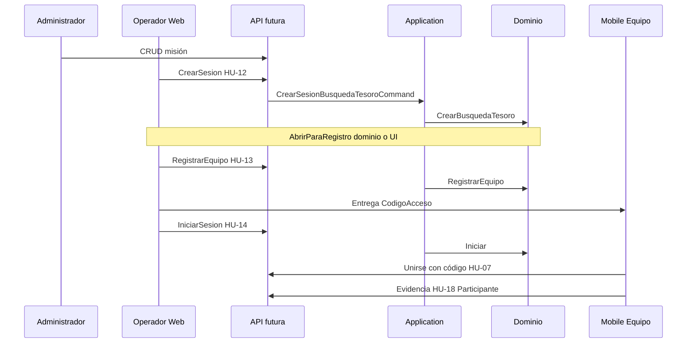

# Roles y autenticación — qué aplica en cada fase

Referencia: `docs/TRAZABILIDAD.md`, `umbral-backend-spec.md` §7.

---

## Actores del producto

| Rol | Cliente | Responsabilidad principal |
|-----|---------|---------------------------|
| **Administrador** | Web | Misiones (HU-01…HU-10) |
| **Operador** | Web | Sesiones BT/Trivia en vivo |
| **Equipo participante** | Mobile | Unirse con código, jugar (evidencias, trivia) |

JWT (futuro): claim `role` = `Administrador` | `Operador` | `Participante`.

---

## Flujo BT típico (operador + participante)

---

## Fase 2 (Application) — qué SÍ y qué NO

| Tema | ¿En Fase 2? | Detalle |
|------|-------------|---------|
| Commands / handlers | Sí | Orquestan dominio |
| `OperadorId` en `CrearSesion` | Sí | GUID en command (luego vendrá del JWT `sub`) |
| `[Authorize(Roles=…)]` | **No** | Capa API |
| Identity / login / registro usuarios | **No** | Entrega auth (tracker: Auth JWT) |
| RB-27 (operador solo sus sesiones) | **No** | Requiere persistencia + claims |
| Equipo solo mobile | **No** en commands actuales | `Participante` en endpoints de juego |

Los handlers **no comprueban rol**: asumen que el mediator solo los invoca desde un endpoint ya autorizado (más adelante).

---

## Matriz comando ↔ rol esperado (API futura)

| Command (Fase 2) | Rol que lo usará |
|------------------|------------------|
| `CrearSesionBusquedaTesoro` | Operador, Administrador |
| `RegistrarEquipo` | Operador, Administrador |
| `IniciarSesion` / `Pausar` / `Reanudar` | Operador, Administrador |
| `AplicarPenalizacion` (02-04) | Operador, Administrador |
| `SubmitEvidencia` (02-05) | **Participante** |
| Queries ranking / sesión | Autenticados según spec |

---

## Resumen

Sí existen **admin, operador y participante (jugador)** en el diseño del ERS. En **Fase 2** solo modelamos **casos de uso** y `UsuarioId` donde el dominio lo exige; la **seguridad por rol** se conecta cuando existan API + JWT + Identity.
