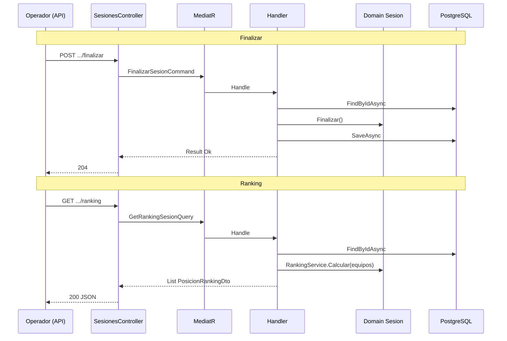

# Iteración 04-05 — Sesiones: cerrar y ranking

## Objetivo

Cerrar el ciclo de vida de la sesión en la API REST (HU-23) y exponer la consulta de ranking en vivo (HU-21), reutilizando la lógica ya implementada en Application y Domain en Fase 2.

Con esta iteración, el `SesionesController` cubre el flujo operador completo: crear → equipos → iniciar → juego (pausa, penalización, evidencias) → **finalizar o cancelar** → consultar **ranking**.

---

## Historias y reglas de dominio

| HU | Capacidad | Reglas relevantes (Domain) |
|----|-----------|----------------------------|
| **HU-23** | Finalizar o cancelar sesión | `Finalizar()` solo desde `Activa` o `Pausada` → `Finalizada`; emite `SesionFinalizada`. |
| **HU-23** | Cancelar con motivo | `Cancelar(motivo)` prohibido si ya está `Finalizada` o `Cancelada`; motivo no vacío (RB-20). |
| **HU-21** | Ranking en vivo | `RankingService.Calcular`: orden descendente por `PuntajeTotal`, desempate alfabético por nombre (RB-08). |

La capa Application **no duplica** esas reglas: los handlers cargan el agregado, invocan el método de dominio (o el servicio de ranking) y persisten.

---

## Endpoints expuestos

| Método | Ruta | Rol | Command / Query | HTTP éxito |
|--------|------|-----|-----------------|------------|
| `POST` | `/api/v1/sesiones/{id}/finalizar` | Operador, Administrador | `FinalizarSesionCommand` | **204** No Content |
| `POST` | `/api/v1/sesiones/{id}/cancelar` | Operador, Administrador | `CancelarSesionCommand` | **204** No Content |
| `GET` | `/api/v1/sesiones/{id}/ranking` | Cualquier usuario autenticado | `GetRankingSesionQuery` | **200** OK + lista |

### Cuerpo de cancelación

```json
{
  "motivo": "Clima adverso — actividad suspendida"
}
```

### Respuesta de ranking (ejemplo)

```json
[
  {
    "posicion": 1,
    "equipoId": "a1b2c3d4-...",
    "nombreEquipo": "Beta",
    "puntajeTotal": 100
  },
  {
    "posicion": 2,
    "equipoId": "e5f6g7h8-...",
    "nombreEquipo": "Alpha",
    "puntajeTotal": 0
  }
]
```

Tras una evidencia **válida** que gana la etapa, el equipo suma **100 puntos** (`CalculoPuntajeBusquedaService`, ganador de etapa).

---

## Flujo HTTP (resumen)



### Mapeo de errores (igual que iteraciones anteriores)

| Origen | `tipo` en JSON | HTTP |
|--------|----------------|------|
| FluentValidation (`SesionId` vacío, `motivo` vacío) | `ValidationError` | 400 |
| `DomainException` (estado no permite finalizar/cancelar) | `DomainError` | 400 |
| `NotFoundException` (sesión inexistente) | `NotFound` | 404 |

El middleware `ExceptionHandlingMiddleware` traduce las excepciones; el controller no contiene `try/catch`.

---

## Archivos tocados

| Archivo | Cambio |
|---------|--------|
| `SesionesController.cs` | Tres acciones nuevas |
| `Contracts/Sesiones/CancelarSesionRequest.cs` | DTO entrada cancelar |
| `Contracts/Sesiones/PosicionRankingResponse.cs` | DTO salida ranking |
| `tests/.../SesionesControllerTests.cs` | 9 tests de integración |
| `SesionRepository.cs` | `SyncEquiposPuntajeAsync`: actualiza `puntaje_total` al guardar (necesario para ranking tras evidencia/penalización) |

Application y Domain sin cambios: los commands/queries ya existían desde Fase 2.

### Ajuste de persistencia (ranking real)

El repositorio ya actualizaba estado de sesión, `ContextoBT` e hijos nuevos, pero **no** el puntaje de equipos existentes. Al probar `GET ranking` tras una evidencia válida, ambos equipos seguían en 0 en BD.

Se añadió sincronización con `ExecuteUpdate` por cada `EquipoSesion`, alineada al patrón híbrido del repositorio (misma razón que `SyncContextoBtAsync`).

---

## Tests de integración (`Umbral.API.Tests`)

| Test | Qué verifica |
|------|----------------|
| `POST_finalizar_CuandoSesionActiva_Retorna204` | Happy path tras crear → equipo → iniciar |
| `POST_finalizar_CuandoSesionNoIniciada_Retorna400` | Dominio: no se finaliza en `EnPreparacion` |
| `POST_finalizar_CuandoSesionNoExiste_Retorna404` | Sesión inexistente |
| `POST_cancelar_CuandoMotivoValido_Retorna204` | Cancelación en sesión activa |
| `POST_cancelar_CuandoMotivoVacio_Retorna400` | Validación FluentValidation (`motivo`) |
| `POST_cancelar_CuandoSesionYaFinalizada_Retorna400` | Dominio: no cancelar sesión finalizada |
| `POST_cancelar_CuandoSesionNoExiste_Retorna404` | Sesión inexistente |
| `GET_ranking_CuandoEmpateOrdenaPorNombre_Retorna200` | Empate 0 pts → Alpha antes que Zeta |
| `GET_ranking_DespuesDeEvidenciaValida_OrdenaPorPuntaje` | Beta con 100 pts tras QR `QR-API-001` |
| `GET_ranking_CuandoSesionNoExiste_Retorna404` | Sesión inexistente |

---

## Validación

```powershell
cd "C:\Users\sayag\OneDrive\Desktop\ProyectoDesarrollo\UMBRAL_UCAB"
dotnet build Umbral.sln
dotnet test tests/Umbral.API.Tests/Umbral.API.Tests.csproj
```

Requiere **Docker** para Testcontainers (PostgreSQL efímero).

---

## Notas

- **Auth:** en Development/Testing sigue `TestAuthHandler` (fase A del tracker). Ranking exige solo `[Authorize]` — cualquier rol del handler de prueba puede consultarlo.
- **Siguiente iteración:** **04-05b** — login real, JWT por rol y usuarios en BD (necesario para demo al profesor). Después **04-06** — CRUD de misiones.
- **Commit sugerido:** `feat(api): iter-04-05 endpoints finalizar cancelar y ranking`
