# UMBRAL — Modelo de Dominio

> **Trazabilidad:** reglas **RB-01…RB-37** y HUs en [`TRAZABILIDAD.md`](TRAZABILIDAD.md). Matriz normativa E1/E2: [`ERS_UMBRAL_UCAB_Sayago.md`](ERS_UMBRAL_UCAB_Sayago.md) §4.1 y §6.1.  
> **TO-BE (2026):** misión polimórfica (`CatalogoMision`), sesión unificada (`ContextoMision`), BC `IdentidadYAccesos`.  
> **Cliente participante:** aplicación web (`umbral-web`); no hay app móvil nativa (fuera de alcance ERS §4).

## Alcance del modelo respecto al código

| Leyenda | Significado |
|---------|-------------|
| **Implementado** | Existe en `Umbral.Domain` y está cableado en Application/Infrastructure |
| **Parcial** | Existe en dominio o BD pero falta API, UI o regla completa |
| **E2** | Diseñado en este documento; pendiente de implementación (Entrega 2) |
| **Legacy** | Mantenido solo por datos o endpoints antiguos; no es el flujo TO-BE |

```mermaid
classDiagram

    %% ══════════════════════════════════════════════════
    %% BC: CATÁLOGO DE MISIONES — etapas polimórficas
    %% ══════════════════════════════════════════════════

    class Mision {
        <<AggregateRoot>>
        +MisionId misionId
        +string nombre
        +EstadoMision estado
        +List~Etapa~ etapas
        +Activar() void
        +Desactivar() void
        +AgregarEtapaBusquedaTesoro(desc, qr) void
        +AgregarEtapaTrivia(categoriaIds) void
        +AgregarPistaAEtapa(etapaId, ...) void
        +PuedeUsarseParaSesion() bool
    }

    class Etapa {
        <<abstract Entity>>
        +EtapaId etapaId
        +MisionId misionId
        +int orden
        +TipoEtapa Tipo*
    }

    class EtapaBusquedaTesoro {
        <<Entity>>
        +string descripcion
        +string codigoQRSolucion
        +List~Pista~ pistas
        +AgregarPista(...) void
    }

    class EtapaTrivia {
        <<Entity>>
        +List~CategoriaId~ categoriaIds
        +AsignarCategorias(ids) void
    }

    class Pista {
        <<Entity>>
        +PistaId pistaId
        +string contenido
        +TipoLiberacion tipoLiberacion
        +int segundosLiberacion
    }

    class MisionSnapshot {
        <<ValueObject>>
        +MisionId misionId
        +string nombre
        +List~EtapaSnapshotBase~ etapas
    }

    class EtapaSnapshotBase {
        <<abstract>>
        +EtapaId id
        +int orden
        +TipoEtapa tipo
    }

    class EtapaBusquedaTesoroSnapshot {
        +string descripcion
        +string codigoQRSolucion
        +List~PistaSnapshot~ pistas
    }

    class EtapaTriviaSnapshot {
        +List~CategoriaId~ categoriaIds
        +List~PreguntaId~ preguntasOrdenadas
        +string categoriasTitulo
    }

    class TipoEtapa {
        <<Enumeration>>
        BusquedaTesoro
        Trivia
    }

    %% ══════════════════════════════════════════════════
    %% BC: CATÁLOGO DE TRIVIA — banco (referenciado por etapas)
    %% ══════════════════════════════════════════════════

    class Pregunta {
        <<AggregateRoot>>
        +PreguntaId preguntaId
        +string enunciado
        +List~OpcionRespuesta~ opciones
        +CategoriaId categoriaId
        +Dificultad dificultad
        +bool eliminada
        +int segundosRespuesta
        +DesactivarLogicamente() void
    }

    class OpcionRespuesta {
        <<ValueObject>>
        +OpcionId opcionId
        +string texto
        +bool isCorrecta
    }

    class Categoria {
        <<AggregateRoot>>
        +CategoriaId categoriaId
        +string nombre
        +RenombrarA(nombre) void
    }

    %% ══════════════════════════════════════════════════
    %% BC: IDENTIDAD Y ACCESOS
    %% ══════════════════════════════════════════════════

    class UsuarioAdministrable {
        <<AggregateRoot>>
        +UsuarioAdministrableId id
        +EmailAddress email
        +string username
        +string nombre
        +string apellido
        +KeycloakUserId keycloakUserId
        +EstadoUsuario estado
        +string passwordAsignada
        +List~RolSistema~ roles
        +Crear(...) UsuarioAdministrable$
        +AsignarRoles(roles) void
        +Activar() void
        +Bloquear() void
    }

    class EmailAddress {
        <<ValueObject>>
        +string valor
    }

    class KeycloakUserId {
        <<ValueObject>>
        +string valor
    }

    class RolSistema {
        <<Enumeration>>
        Administrador
        Operador
        Participante
    }

    class EstadoUsuario {
        <<Enumeration>>
        Pendiente
        Activo
        Bloqueado
    }

    %% ══════════════════════════════════════════════════
    %% BC: EJECUCIÓN DE SESIÓN — sesión de misión unificada
    %% ══════════════════════════════════════════════════

    class Sesion {
        <<AggregateRoot>>
        +SesionId sesionId
        +string nombre
        +TipoSesion tipoSesion
        +MisionId misionId
        +UsuarioId operadorId
        +EstadoSesion estado
        +CodigoAcceso codigoAcceso
        +ContextoMision contextoMision
        +List~ParticipanteSesion~ participantes
        +CrearDesdeMision(snapshot, operadorId, nombreSesion)$ Sesion
        +UnirseParticipante(jugadorId, nombre, codigo) ParticipanteSesion
        +AbandonarParticipante(jugadorId) ParticipanteId
        +RegistrarEvidencia(participanteId, qr) Evidencia
        +AplicarPenalizacion(participanteId, penalizacion) void
        +Iniciar() void
        +Pausar() void
        +Finalizar() void
    }

    class ContextoMision {
        <<Entity>>
        +MisionId misionId
        +MisionSnapshot misionSnapshot
        +int etapaActualIndex
        +ParticipanteId ganadorEtapaActualId
        +int preguntaTriviaActualIndex
        +ObtenerEtapaActual() EtapaSnapshotBase
        +ObtenerEtapaBusquedaTesoroActual() EtapaBusquedaTesoroSnapshot
        +EsUltimaEtapa() bool
        +AvanzarEtapa() void
    }

    class ContextoBusquedaTesoro {
        <<Entity - legacy>>
        +MisionSnapshot misionSnapshot
        +int etapaActualIndex
        +ObtenerEtapaActual() EtapaBusquedaTesoroSnapshot
    }

    class ContextoTrivia {
        <<Entity - legacy>>
        +List~PreguntaId~ preguntasOrdenadas
        +int preguntaActualIndex
        +string categoriasTitulo
    }

    class ParticipanteSesion {
        <<Entity>>
        +ParticipanteId participanteId
        +UsuarioId jugadorId
        +NombreParticipante nombre
        +int puntajeTotal
        +SumarPuntaje(puntos) void
        +AplicarPenalizacion(penalizacion) void
    }

    class Evidencia {
        <<Entity>>
        +EvidenciaId evidenciaId
        +ParticipanteId participanteId
        +EtapaId etapaId
        +CodigoQR codigoQR
        +ResultadoValidacion resultado
    }

    class RespuestaTrivia {
        <<Entity - E2>>
        +RespuestaId respuestaId
        +ParticipanteId participanteId
        +PreguntaId preguntaId
        +bool esCorrecta
        +Puntaje puntosObtenidos
        +DateTime respondidoEn
    }

    class Penalizacion {
        <<ValueObject>>
        +int puntos
        +string motivo
        +UsuarioId operadorId
    }

    class EventoSesion {
        <<Entity>>
        +EventoId eventoId
        +string tipo
        +string payload
        +DateTime ocurridoEn
    }

    %% ══════════════════════════════════════════════════
    %% ENUMERACIONES SESIÓN
    %% ══════════════════════════════════════════════════

    class TipoSesion {
        <<Enumeration>>
        Mision
        BusquedaTesoro
        Trivia
    }

    class EstadoSesion {
        <<Enumeration>>
        Programada
        EnPreparacion
        Activa
        Pausada
        Finalizada
        Cancelada
    }

    class EstadoMision {
        <<Enumeration>>
        Borrador
        Activa
        Inactiva
    }

    class TipoLiberacion {
        <<Enumeration>>
        PorTiempo
        PorGanador
    }

    class ResultadoValidacion {
        <<Enumeration>>
        Valida
        Invalida
        Rechazada
    }

    class Puntaje {
        <<ValueObject>>
        +int valor
    }

    class CodigoQR {
        <<ValueObject>>
        +string valor
    }

    class CodigoAcceso {
        <<ValueObject>>
        +string valor
        +Generar() CodigoAcceso$
    }

    %% ══════════════════════════════════════════════════
    %% DOMAIN SERVICES
    %% ══════════════════════════════════════════════════

    class ValidacionEvidenciaService {
        <<DomainService>>
        +Validar(sesion, participanteId, codigoQR) ResultadoValidacion
    }

    class RankingService {
        <<DomainService>>
        +Calcular(participantes) List~PosicionRanking~
    }

    class PistaEntregada {
        <<Entity - E2>>
        +ParticipanteId participanteId
        +PistaId pistaId
        +EtapaId etapaId
        +DateTime entregadaEn
    }

    %% ══════════════════════════════════════════════════
    %% DOMAIN EVENTS (muestra)
    %% ══════════════════════════════════════════════════

    class SesionCreada {
        <<DomainEvent>>
        +SesionId sesionId
        +TipoSesion tipoSesion
        +UsuarioId operadorId
    }

    class UsuarioCreadoEnDominio {
        <<DomainEvent>>
        +UsuarioAdministrableId id
        +EmailAddress email
    }

    class EvidenciaValidada {
        <<DomainEvent>>
        +SesionId sesionId
        +ParticipanteId participanteGanadorId
        +EtapaId etapaId
    }

    %% ══════════════════════════════════════════════════
    %% PUERTOS
    %% ══════════════════════════════════════════════════

    class IMisionRepository {
        <<Port_Driven>>
        +SaveAsync(mision) Task
        +FindByIdAsync(id) Task
        +FindActivasAsync() Task
    }

    class ISesionRepository {
        <<Port_Driven>>
        +SaveAsync(sesion) Task
        +FindByIdAsync(id) Task
        +FindDisponiblesParaParticipanteAsync(tipo) Task
    }

    class IUsuarioRepository {
        <<Port_Driven>>
        +SaveAsync(usuario) Task
        +FindByEmailAsync(email) Task
    }

    class IIdentityService {
        <<Port_Driven>>
        +RegistrarUsuarioAsync(...) Task~KeycloakUserId~
        +EliminarEnIdentityServerAsync(id) Task
    }

    class IPreguntaRepository {
        <<Port_Driven>>
        +FindByCategoriaAsync(catId) Task
    }

    class IEventPublisher {
        <<Port_Driven>>
        +PublishBatchAsync(eventos) Task
    }

    %% ══════════════════════════════════════════════════
    %% RELACIONES
    %% ══════════════════════════════════════════════════

    Mision "1" *-- "1..*" Etapa : contiene
    Etapa <|-- EtapaBusquedaTesoro
    Etapa <|-- EtapaTrivia
    EtapaBusquedaTesoro "1" *-- "0..*" Pista : tiene
    EtapaTrivia --> "1..*" Categoria : referencia por id
    Pregunta --> Categoria : clasificada en

    MisionSnapshot *-- EtapaSnapshotBase : congela
    EtapaSnapshotBase <|-- EtapaBusquedaTesoroSnapshot
    EtapaSnapshotBase <|-- EtapaTriviaSnapshot

    Sesion "1" --> "1" TipoSesion
    Sesion "1" --> "0..1" MisionId
    Sesion "1" o-- "0..1" ContextoMision : contexto TO-BE
    Sesion "1" o-- "0..1" ContextoBusquedaTesoro : legacy
    Sesion "1" o-- "0..1" ContextoTrivia : legacy
    Sesion "1" *-- "1..*" ParticipanteSesion
    Sesion "1" *-- "0..*" Evidencia
    Sesion "1" *-- "0..*" RespuestaTrivia : E2
    Sesion "1" *-- "0..*" PistaEntregada : E2
    ContextoMision --> MisionSnapshot

    UsuarioAdministrable --> EmailAddress
    UsuarioAdministrable --> KeycloakUserId
    UsuarioAdministrable --> RolSistema

    ValidacionEvidenciaService ..> ContextoMision : etapa activa BT
    RankingService ..> ParticipanteSesion : ordena

    Mision ..> IMisionRepository
    Sesion ..> ISesionRepository
    UsuarioAdministrable ..> IUsuarioRepository
    UsuarioAdministrable ..> IIdentityService
    Pregunta ..> IPreguntaRepository
    Sesion ..> IEventPublisher
```

## Notas de alineación con el código

| Concepto | Estado | Detalle |
|----------|--------|---------|
| **Misión polimórfica** | Implementado | `CatalogoMision`, `EtapaBusquedaTesoro`, `EtapaTrivia`, `Pista` en catálogo (HU-01..08, RF-01/02). |
| **Sesión unificada** | Implementado | `Sesion.CrearDesdeMision` + `ContextoMision`; avance BT RB-04/05/34; trivia en sesión unificada → E2. |
| **`Sesion.Nombre`** | Implementado | Nombre de instancia operativa; único entre sesiones no finalizadas/canceladas (extensión operativa, no sustituye código de acceso). |
| **Legacy** | Legacy | `ContextoBusquedaTesoro`, `ContextoTrivia`, `TipoSesion.BusquedaTesoro`/`Trivia` y commands obsoletos solo por datos/API antiguos. |
| **Banco trivia** | Implementado | `Categoria`, `Pregunta`, soft delete RB-16; RF-23/24. |
| **`Pregunta.segundosRespuesta`** | E2 | RF-25; previsto en diagrama; aún no existe en `Umbral.Domain`. |
| **Evidencia BT** | Implementado | `RegistrarEvidencia`, `ValidacionEvidenciaService`, RF-07..11, RF-20. |
| **Penalización** | Implementado | `AplicarPenalizacion`, RB-20/24/25. |
| **Ranking** | ✅ | `RankingService` por puntaje descendente; desempate RB-08/HU-39 por menor tiempo acumulado de respuestas a tiempo; empate residual por nombre. |
| **`EventoSesion`** | Parcial | Se persiste en dominio/BD; consulta API de auditoría HU-22 → E2. |
| **Liberación de pistas** | E1 parcial (HU-09, HU-10, RF-15) | `PorTiempo` + `PorGanador` + pista ad-hoc operador ✅; SignalR real → E2. |
| **`RespuestaTrivia` / trivia en vivo** | E1 parcial | HU-34 sync submit + puntaje; HU-35 cola RabbitMQ pendiente. |
| **`IEventPublisher`** | Parcial | Puerto en dominio ✅; implementación `NoOpEventPublisher` en E1; RabbitMQ real RF-19/29, RNF-05 → E2. |
| **Tiempo real (WebSockets)** | E1 parcial (HU-15) | `SesionHub` + `NotificacionRealTimeService` (estado sesión + pistas); TriviaHub → E2. |
| **Identidad Keycloak** | Implementado | `UsuarioAdministrable`, doble commit, compensación RB-37, RF-31/33/34. |
| **Roles en admin** | Implementado | Un rol por usuario (`Administrador`, `Operador` o `Participante` para cuentas demo); ver RB-35 actualizado en ERS. |
| **Participación en juego** | Implementado | Inscripción con código de acceso + nombre único RB-02; rol Keycloak `Participante` no sustituye la inscripción a sesión. |
| **RB-27 operador** | Implementado | Listado de sesiones filtrado por `operadorId`. |

### Puertos e infraestructura

| Puerto | E1 | E2 |
|--------|----|----|
| `IMisionRepository`, `ISesionRepository`, `IUsuarioRepository`, `IPreguntaRepository` | EF Core + PostgreSQL | — |
| `IIdentityService` | Keycloak (admin API) | — |
| `IEventPublisher` | `NoOpEventPublisher` (handlers llaman al puerto) | Publicador RabbitMQ + consumers |

Referencia operativa: [`RESUMEN-COMPACTO-E1-E2.md`](RESUMEN-COMPACTO-E1-E2.md).
