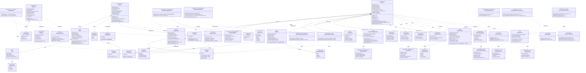

# UMBRAL — Modelo de Dominio

> **Trazabilidad:** reglas **RB-01…RB-32** y HUs en [`TRAZABILIDAD.md`](TRAZABILIDAD.md). Progreso dominio Fase 1: [`fase-1/TRACKER.md`](fase-1/TRACKER.md).

```mermaid
classDiagram

    %% ══════════════════════════════════════════════════
    %% BC: CATÁLOGO DE MISIONES — solo BúsquedaTesoro
    %% ══════════════════════════════════════════════════

    class Mision {
        <<AggregateRoot>>
        +MisionId misionId
        +NombreMision nombre
        +string descripcion
        +NivelDificultad nivelDificultad
        +Duracion tiempoMaximo
        +EstadoMision estado
        +List~Etapa~ etapas
        +Activar() void
        +Desactivar() void
        +AgregarEtapa(orden, duracion) void
        +EliminarEtapa(etapaId) void
        +PuedeUsarseParaSesion() bool
    }

    class Etapa {
        <<Entity>>
        +EtapaId etapaId
        +OrdenEtapa orden
        +Duracion tiempoMaximo
        +Duracion tiempoSinGanador
        +CodigoQR codigoQRSolucion
        +List~Pista~ pistas
        +AgregarPista(contenido, orden, tipo) void
        +ValidarCompletitud() bool
        +ObtenerPistaPorOrden(n) Pista
    }

    class Pista {
        <<Entity>>
        +PistaId pistaId
        +string contenido
        +OrdenAparicion orden
        +TipoLiberacion tipoLiberacion
    }

    %% ══════════════════════════════════════════════════
    %% BC: CATÁLOGO DE TRIVIA — solo Trivia
    %% ══════════════════════════════════════════════════

    class Pregunta {
        <<AggregateRoot>>
        +PreguntaId preguntaId
        +string enunciado
        +List~OpcionRespuesta~ opciones
        +CategoriaId categoriaId
        +Dificultad dificultad
        +int tiempoRespuestaMs
        +bool isDeleted
        +EsValida() bool
        +DesactivarLogicamente() void
    }

    class OpcionRespuesta {
        <<ValueObject>>
        +OpcionId opcionId
        +string texto
        +bool isCorrecta
    }

    class Categoria {
        <<AggregateRoot>>
        +CategoriaId categoriaId
        +string nombre
        +string descripcion
        +int totalPreguntas
        +RenombrarA(nombre) void
    }

    %% ══════════════════════════════════════════════════
    %% BC: EJECUCIÓN DE SESIÓN — compartido ambos modos
    %% ══════════════════════════════════════════════════

    class Sesion {
        <<AggregateRoot>>
        +SesionId sesionId
        +TipoSesion tipoSesion
        +UsuarioId operadorId
        +EstadoSesion estado
        +List~EquipoSesion~ equipos
        +List~EventoSesion~ historialEventos
        +DateTime iniciadaEn
        +DateTime finalizadaEn
        +Iniciar() void
        +Pausar() void
        +Reanudar() void
        +Finalizar() void
        +Cancelar(motivo) void
        +RegistrarEquipo(nombre) EquipoSesion
        +AplicarPenalizacion(equipoId, penalizacion) void
        +EstaEnEstadoActivo() bool
    }

    class ContextoBusquedaTesoro {
        <<Entity>>
        +MisionSnapshot misionSnapshot
        +int etapaActualIndex
        +List~PistaId~ pistasLiberadas
        +AvanzarEtapa() void
        +LiberarPista(equipoId, pistaId) void
        +ObtenerEtapaActual() EtapaSnapshot
        +EsUltimaEtapa() bool
    }

    class ContextoTrivia {
        <<Entity>>
        +List~PreguntaId~ preguntasOrdenadas
        +int preguntaActualIndex
        +DateTime timerCerradoEn
        +LanzarPregunta() PreguntaId
        +CerrarTimer(momento) void
        +EsUltimaPregunta() bool
    }

    class EquipoSesion {
        <<Entity>>
        +EquipoId equipoId
        +NombreEquipo nombre
        +CodigoAcceso codigoAcceso
        +Puntaje puntajeTotal
        +long tiempoAcumuladoMs
        +bool bloqueadoParaRondaActual
        +SumarPuntaje(puntos) void
        +AplicarPenalizacion(penalizacion) void
        +BloquearParaRonda() void
    }

    class Evidencia {
        <<Entity>>
        +EvidenciaId evidenciaId
        +EquipoId equipoId
        +EtapaId etapaId
        +CodigoQR codigoQR
        +DateTime timestampServidor
        +ResultadoValidacion resultado
        +Validar(codigoEsperado) ResultadoValidacion
    }

    class RespuestaTrivia {
        <<Entity>>
        +RespuestaId respuestaId
        +EquipoId equipoId
        +PreguntaId preguntaId
        +OpcionId opcionSeleccionada
        +DateTime timestampServidor
        +bool esCorrecta
        +Puntaje puntosObtenidos
        +EstadoRespuesta estado
        +Procesar(opcionCorrecta, timerCerradoEn) Puntaje
    }

    class Penalizacion {
        <<ValueObject>>
        +int puntos
        +string motivo
        +UsuarioId operadorId
        +DateTime aplicadaEn
    }

    class EventoSesion {
        <<Entity>>
        +EventoId eventoId
        +string tipo
        +string payload
        +DateTime ocurridoEn
        +UsuarioId originadoPor
    }

    %% ══════════════════════════════════════════════════
    %% VALUE OBJECTS / ENUMERACIONES
    %% ══════════════════════════════════════════════════

    class TipoSesion {
        <<Enumeration>>
        BusquedaTesoro
        Trivia
    }

    class EstadoSesion {
        <<Enumeration>>
        Programada
        EnPreparacion
        Activa
        Pausada
        Finalizada
        Cancelada
    }

    class EstadoMision {
        <<Enumeration>>
        Inactiva
        Activa
    }

    class TipoLiberacion {
        <<Enumeration>>
        PorTiempo
        PorGanador
    }

    class ResultadoValidacion {
        <<Enumeration>>
        Valida
        Invalida
        Rechazada
    }

    class EstadoRespuesta {
        <<Enumeration>>
        Pendiente
        Correcta
        Incorrecta
        FueraDeTiempo
    }

    class Puntaje {
        <<ValueObject>>
        +int valor
        +Sumar(cantidad) Puntaje
        +Restar(cantidad) Puntaje
        +Zero() Puntaje$
    }

    class CodigoQR {
        <<ValueObject>>
        +string valor
        +CoincideCon(otro) bool
    }

    class CodigoAcceso {
        <<ValueObject>>
        +string valor
        +Generar() CodigoAcceso$
    }

    class Duracion {
        <<ValueObject>>
        +int segundos
        +HaExpirado(inicio) bool
        +DesdMinutos(min) Duracion$
    }

    class NombreMision {
        <<ValueObject>>
        +string valor
        +Crear(nombre) NombreMision$
    }

    %% ══════════════════════════════════════════════════
    %% DOMAIN SERVICES — BúsquedaTesoro
    %% ══════════════════════════════════════════════════

    class ValidacionEvidenciaService {
        <<DomainService - BusquedaTesoro>>
        +Validar(contexto, equipoId, codigoQR) ResultadoValidacion
        +EsGanadorUnico(contexto, etapaId) bool
    }

    class CalculoPuntajeBusquedaService {
        <<DomainService - BusquedaTesoro>>
        +Calcular(etapa, esGanador) Puntaje
        +AplicarPenalizacion(equipo, penalizacion) Puntaje
    }

    class LiberacionPistasService {
        <<DomainService - BusquedaTesoro>>
        +LiberarPorTiempo(contexto, etapaId) void
        +LiberarPorGanador(contexto, etapaGanada) void
        +LiberarManual(contexto, operadorId, pistaId, equipoId) void
        +PuedeLiberar(equipo, pista) bool
    }

    class TransicionEtapaService {
        <<DomainService - BusquedaTesoro>>
        +AvanzarSesion(sesion, contexto) void
        +EsUltimaEtapa(contexto) bool
    }

    %% ══════════════════════════════════════════════════
    %% DOMAIN SERVICES — Trivia
    %% ══════════════════════════════════════════════════

    class ValidacionRespuestaTriviaService {
        <<DomainService - Trivia>>
        +Validar(respuesta, pregunta, timerCerradoEn) bool
        +EsFueraDeTiempo(timestampRespuesta, timerCerradoEn) bool
    }

    class CalculoPuntajeTriviaService {
        <<DomainService - Trivia>>
        +Calcular(pregunta, esCorrecta, tiempoMs) Puntaje
        +AplicarPenalizacion(equipo, penalizacion) Puntaje
    }

    class TransicionPreguntaService {
        <<DomainService - Trivia>>
        +LanzarSiguientePregunta(sesion, contexto) void
        +EsUltimaPregunta(contexto) bool
        +IniciarTransicion(duracionMs) void
    }

    %% ══════════════════════════════════════════════════
    %% DOMAIN SERVICES — Compartidos
    %% ══════════════════════════════════════════════════

    class RankingService {
        <<DomainService - Compartido>>
        +Calcular(sesion) List~PosicionRanking~
        +Ordenar(equipos) List~PosicionRanking~
    }

    %% ══════════════════════════════════════════════════
    %% DOMAIN EVENTS — Compartidos
    %% ══════════════════════════════════════════════════

    class SesionCreada {
        <<DomainEvent>>
        +SesionId sesionId
        +TipoSesion tipoSesion
        +UsuarioId operadorId
        +DateTime ocurridoEn
    }

    class SesionIniciada {
        <<DomainEvent>>
        +SesionId sesionId
        +TipoSesion tipoSesion
        +DateTime ocurridoEn
    }

    class SesionPausada {
        <<DomainEvent>>
        +SesionId sesionId
        +DateTime pausadaEn
    }

    class SesionFinalizada {
        <<DomainEvent>>
        +SesionId sesionId
        +List~PosicionRanking~ rankingFinal
        +DateTime finalizadaEn
    }

    class PenalizacionAplicada {
        <<DomainEvent>>
        +SesionId sesionId
        +EquipoId equipoId
        +int puntos
        +string motivo
        +DateTime ocurridoEn
    }

    %% ══════════════════════════════════════════════════
    %% DOMAIN EVENTS — BúsquedaTesoro
    %% ══════════════════════════════════════════════════

    class EvidenciaValidada {
        <<DomainEvent - BusquedaTesoro>>
        +SesionId sesionId
        +EquipoId equipoGanadorId
        +EtapaId etapaId
        +Puntaje puntosOtorgados
        +DateTime ocurridoEn
    }

    class EtapaCompletada {
        <<DomainEvent - BusquedaTesoro>>
        +SesionId sesionId
        +int etapaCompletadaIndex
        +EquipoId equipoGanadorId
        +DateTime ocurridoEn
    }

    class PistaLiberada {
        <<DomainEvent - BusquedaTesoro>>
        +SesionId sesionId
        +EquipoId equipoId
        +PistaId pistaId
        +TipoLiberacion tipoLiberacion
        +DateTime ocurridoEn
    }

    %% ══════════════════════════════════════════════════
    %% DOMAIN EVENTS — Trivia
    %% ══════════════════════════════════════════════════

    class PreguntaLanzada {
        <<DomainEvent - Trivia>>
        +SesionId sesionId
        +PreguntaId preguntaId
        +int timerMs
        +DateTime ocurridoEn
    }

    class RespuestaTriviaRecibida {
        <<DomainEvent - Trivia>>
        +SesionId sesionId
        +PreguntaId preguntaId
        +EquipoId equipoId
        +OpcionId opcionId
        +DateTime timestampServidor
    }

    class TiempoAgotado {
        <<DomainEvent - Trivia>>
        +SesionId sesionId
        +PreguntaId preguntaId
        +DateTime ocurridoEn
    }

    %% ══════════════════════════════════════════════════
    %% PUERTOS — Arquitectura Hexagonal
    %% ══════════════════════════════════════════════════

    class IMisionRepository {
        <<Port_Driven>>
        +Save(mision) Task
        +FindById(id) Task~Mision~
        +FindActivas() Task~List~
        +ExisteNombre(nombre) Task~bool~
    }

    class ISesionRepository {
        <<Port_Driven>>
        +Save(sesion) Task
        +FindById(id) Task~Sesion~
        +FindByOperador(operadorId) Task~List~
    }

    class IPreguntaRepository {
        <<Port_Driven>>
        +Save(pregunta) Task
        +FindById(id) Task~Pregunta~
        +FindByCategoria(catId) Task~List~
        +FindActivas() Task~List~
    }

    class IEventPublisher {
        <<Port_Driven>>
        +Publish~T~(evento) Task
        +PublishBatch~T~(eventos) Task
    }

    class INotificacionRealTime {
        <<Port_Driven>>
        +NotificarEquipo(equipoId, payload) Task
        +BroadcastSesion(sesionId, payload) Task
        +NotificarOperador(operadorId, payload) Task
    }

    %% ══════════════════════════════════════════════════
    %% RELACIONES
    %% ══════════════════════════════════════════════════

    Mision "1" *-- "1..*" Etapa : contiene
    Etapa "1" *-- "0..*" Pista : tiene
    Etapa "1" --> "1" CodigoQR : solución
    Pista "1" --> "1" TipoLiberacion : tipo
    Mision "1" --> "1" EstadoMision : estado
    Mision "1" --> "1" NombreMision : identificado por
    Mision "1" --> "1" Duracion : tiempoMaximo

    Pregunta "1" *-- "2..*" OpcionRespuesta : compone
    Pregunta "1" --> "1" Categoria : clasificada en

    Sesion "1" --> "1" TipoSesion : determina modo
    Sesion "1" --> "1" EstadoSesion : estado
    Sesion "1" *-- "1..*" EquipoSesion : agrupa
    Sesion "1" *-- "0..*" EventoSesion : historial
    Sesion "1" o-- "0..1" ContextoBusquedaTesoro : contexto si BT
    Sesion "1" o-- "0..1" ContextoTrivia : contexto si Trivia
    Sesion "1" *-- "0..*" Evidencia : registra si BT
    Sesion "1" *-- "0..*" RespuestaTrivia : registra si Trivia
    EquipoSesion "1" --> "1" Puntaje : acumula
    EquipoSesion "1" --> "1" CodigoAcceso : identificado por
    EquipoSesion "1" *-- "0..*" Penalizacion : recibe
    Evidencia "1" --> "1" CodigoQR : contiene
    Evidencia "1" --> "1" ResultadoValidacion : resultado
    RespuestaTrivia "1" --> "1" EstadoRespuesta : estado

    ValidacionEvidenciaService ..> ContextoBusquedaTesoro : opera sobre
    ValidacionEvidenciaService ..> Evidencia : valida
    CalculoPuntajeBusquedaService ..> Puntaje : calcula
    LiberacionPistasService ..> ContextoBusquedaTesoro : opera sobre
    TransicionEtapaService ..> ContextoBusquedaTesoro : avanza
    ValidacionRespuestaTriviaService ..> RespuestaTrivia : valida
    ValidacionRespuestaTriviaService ..> ContextoTrivia : contra timer
    CalculoPuntajeTriviaService ..> Puntaje : calcula
    TransicionPreguntaService ..> ContextoTrivia : avanza
    RankingService ..> EquipoSesion : ordena
    RankingService ..> Puntaje : criterio

    Sesion ..> SesionCreada : emite
    Sesion ..> SesionIniciada : emite
    Sesion ..> SesionPausada : emite
    Sesion ..> SesionFinalizada : emite
    Sesion ..> PenalizacionAplicada : emite
    ValidacionEvidenciaService ..> EvidenciaValidada : emite
    ContextoBusquedaTesoro ..> EtapaCompletada : emite
    ContextoBusquedaTesoro ..> PistaLiberada : emite
    ContextoTrivia ..> PreguntaLanzada : emite
    RespuestaTrivia ..> RespuestaTriviaRecibida : emite
    ContextoTrivia ..> TiempoAgotado : emite

    Sesion ..> ISesionRepository : persiste vía
    Mision ..> IMisionRepository : persiste vía
    Pregunta ..> IPreguntaRepository : persiste vía
    Sesion ..> IEventPublisher : publica vía
    Sesion ..> INotificacionRealTime : notifica vía
```